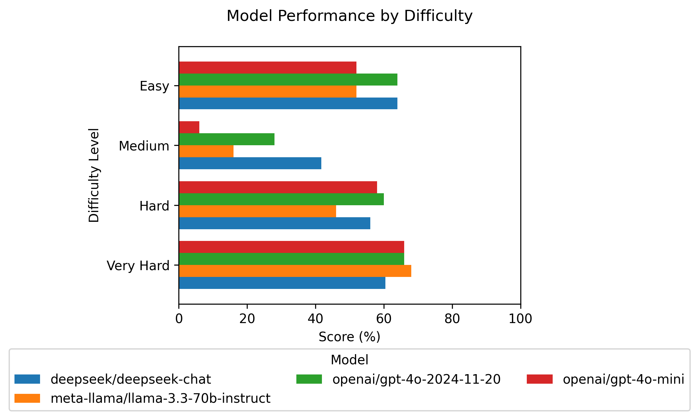

# CrunchBench

In CrunchBench, we ask LLMs to answer analytical questions like **"What are the 3 highest rated productivity apps under $5?"** across different-sized datasets of [mobile app data](https://www.kaggle.com/datasets/ramamet4/app-store-apple-data-set-10k-apps) to measure an LLM's ability to handle lots of unstructured data. 

CrunchBench focuses on a model's ability to:

- Process and analyze unstructured data across different context sizes
- Handle complex filtering and sorting operations
- Perform multi-step reasoning on numerical and categorical data

<!-- **Note:** The dataset contains about 150k tokens, but we currently test only up to 50k tokens. This keeps the benchmark affordable while still thoroughly testing each model's capabilities. -->

## Methodology

### Dataset


Questions range from simple filtering to more complex tasks and logic. Each difficulty level adds more filtering, statistical operations, and reasoning steps. For example:

```markdown
# Easy
- What app has the most reviews?

# Medium
- Among paid apps with 15,000+ reviews, what are the 5 lowest-rated apps?

# Hard
- Which category has the highest total review count among free apps?

# Very Hard
- For apps explicitly mentioning the word "cloud" in their description, what are the top 3 categories by mean rating, considering only apps that have 15,000+ reviews, have a rating ≥ 4.5, and cost more than $1?
```

See the complete list of [benchmark questions](questions.md).

The app store data is from [this Kaggle dataset](https://www.kaggle.com/datasets/ramamet4/app-store-apple-data-set-10k-apps). After preprocessing, the app information is fed to the LLM in the following format:

```markdown
App Name: Facebook
ID: 284882215
Size: 10 MB
Price: 0.0 USD
Rating Count: 2974676
Average User Rating: 3.5
Version: 95.0
Category: Social Networking
Description: Keeping up with friends is faster than ever. 
• See what friends are up to
• Share updates, photos and video
• Get notified when friends like and comment on your posts
• Watch and interact with live video
• Play games and use your favorite apps
```

We have 5 questions across 4 difficulty levels: Easy, Medium, Hard, and Very Hard. Each question is tested across different amounts of context, totaling 20 examples per context size. As we move from 10k to 50k tokens in steps of 10k, that yields 100 total examples.


At each step, the LLM is given the app store data, the question and [the instructions](/evaluation.py#L30-L31). ***We instruct the LLM to use [CoT reasoning](https://learnprompting.org/docs/intermediate/chain_of_thought) before answering the question.**

### Evaluation

We use pandas to generate ground truth answers for each question in [this script](./generate_eval_dataset.py). The same process repeats for each context size, resulting in 100 example questions and answers. Which are published to the [LangSmith Dataset](https://smith.langchain.com/public/18c8f4ba-726a-44b2-99b7-527196a9c80c/d).

We then use an [LLM-as-a-Judge](https://huggingface.co/learn/cookbook/en/llm_judge) (DeepSeek V3) to score each model output, based on:

- **Correct (1.0)**: Perfectly matches the ground truth, including order
- **Partially Correct (0.5)**: Some correct elements but missing details or incorrect order
- **Incorrect (0.0)**: No alignment with the ground truth

## Results

### [CrunchBench Results Dashboard](https://smith.langchain.com/public/18c8f4ba-726a-44b2-99b7-527196a9c80c/d)

Below are the latest results:

  
Figure 1: Average performance across models

  
Figure 2: Performance by difficulty level

  
Figure 3: Performance across context sizes

  
Figure 4: Bang for your buck

## Instructions

1. **Install dependencies and activate environment**:
   ```bash
   poetry install
   poetry shell
   ```
2. **Preprocess the dataset**:

   ```bash
   python preprocess.py
   ```

   This generates the dataset and stores it in `data/`.

3. **Generate the evaluation dataset**:

   ```bash
   python generate_eval_dataset.py
   ```

   This creates the evaluation data, stores it in `data/`, and saves it to LangSmith.

4. **Run the evals**:  
   Open and run the [Run Notebook](./run.ipynb) to start evaluating different models.
