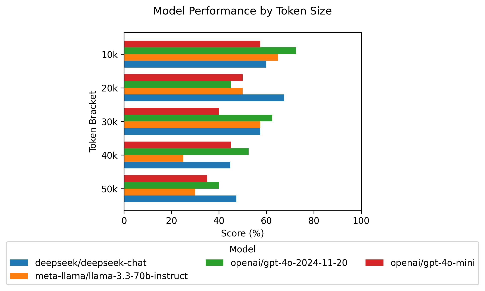

# CrunchBench

This benchmark measures an LLM’s ability to analyze unstructured data. Our goal is to see which model handles real-world data analysis best across various context lengths and difficulty levels.

## Methodology

CrunchBench focuses on a model's ability to:
- Process and analyze unstructured data across different context sizes  
- Handle complex filtering and sorting  
- Perform multi-step reasoning on numerical and categorical data  

**Note:** The dataset contains about 150k tokens, but we currently test only up to 50k tokens. This keeps the benchmark affordable while still thoroughly testing each model’s capabilities.

### Dataset

We have 5 questions across 4 difficulty levels: Easy, Medium, Hard, and Very Hard. Each question is tested across different amounts of context, totaling 20 examples per context size. As we move from 10k to 50k tokens in steps of 10k, that yields 100 total examples.

Questions range from simple filtering (e.g., “Which app has the most reviews?”) to more complex tasks (e.g., “For apps that mention ‘cloud,’ what are the top 3 categories by mean rating, considering only apps with 15,000+ reviews, rating ≥ 4.5, and cost > $1?”). Each difficulty level adds more filtering, statistical operations, and reasoning steps.

### Evaluation

We use pandas to generate ground truth answers for each question in [this script](./generate_eval_dataset.py). The same process repeats for each context size, resulting in 100 example questions and answers. Which are published to the [LangSmith Dataset](https://smith.langchain.com/public/18c8f4ba-726a-44b2-99b7-527196a9c80c/d).

#### Scoring Methodology

We then use an [LLM-as-a-Judge](https://huggingface.co/learn/cookbook/en/llm_judge) (DeepSeek V3) to score each model output, based on:

- **Correct (1.0)**: Perfectly matches the ground truth, including order  
- **Partially Correct (0.5)**: Some correct elements but missing details or incorrect order  
- **Incorrect (0.0)**: No alignment with the ground truth  

## Results

### [CrunchBench Results Dashboard](https://smith.langchain.com/public/18c8f4ba-726a-44b2-99b7-527196a9c80c/d)

Below are the latest results:

  
Figure 1: Average performance across models

  
Figure 2: Performance by difficulty level

  
Figure 3: Performance across context sizes

  
Figure 4: Bang for your buck

## Getting Started

1. **Install dependencies and activate environment**:
   ```bash
   poetry install
   poetry shell
   ```
2. **Preprocess the dataset**:
   ```bash
   python preprocess.py
   ```
   This generates the dataset and stores it in `data/`.

3. **Generate the evaluation dataset**:
   ```bash
   python generate_eval_dataset.py
   ```
   This creates the evaluation data, stores it in `data/`, and saves it to LangSmith.

4. **Run the evals**:  
   Open and run the [Run Notebook](./run.ipynb) to start evaluating different models.